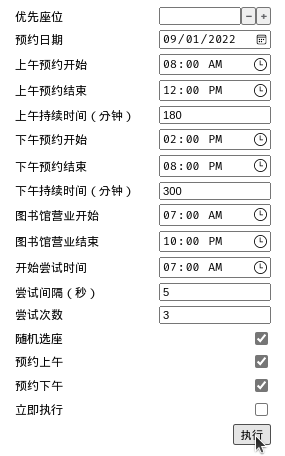
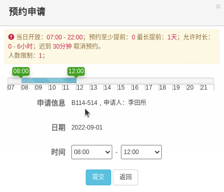

# O My Seat

Oh, occupy that seat for me, plz.

## 安装

**必备条件：**

- 脚本管理器，推荐 [Violentmonkey](https://violentmonkey.github.io/)

点击[此链接](https://raw.githubusercontent.com/doge2x/o-my-seat/main/dist/o-my-seat.min.user.js)进行安装。

## 使用

如下图所示，脚本在每个房间前插入一个旗帜，点击打开执行窗口，

调整好相关参数后，即可执行占座程序。

### 注意事项

【优先座位】使用的名字是预约时显示的座位名字，如下图所示，

## License

This software is released under the either of [MIT License](LICENSE-MIT) or
[Apache License 2.0](LICENSE-APACHE) at your option.
